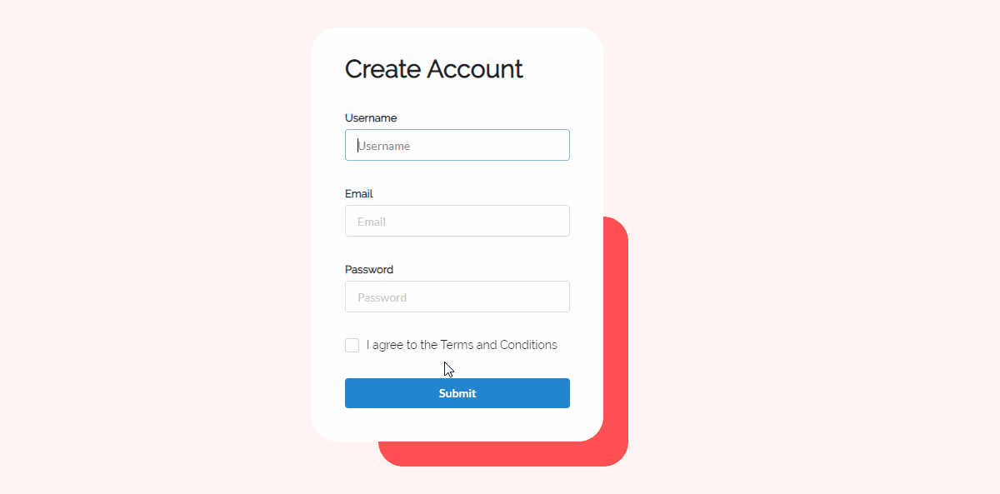

Check out my [Portfolio](https://winjitn.github.io/portfolio).

## Form Validation

Validation checks on submission and displays insufficiencies with messages and mark corresponding fields. Form inputs styled with semantic-ui library.
